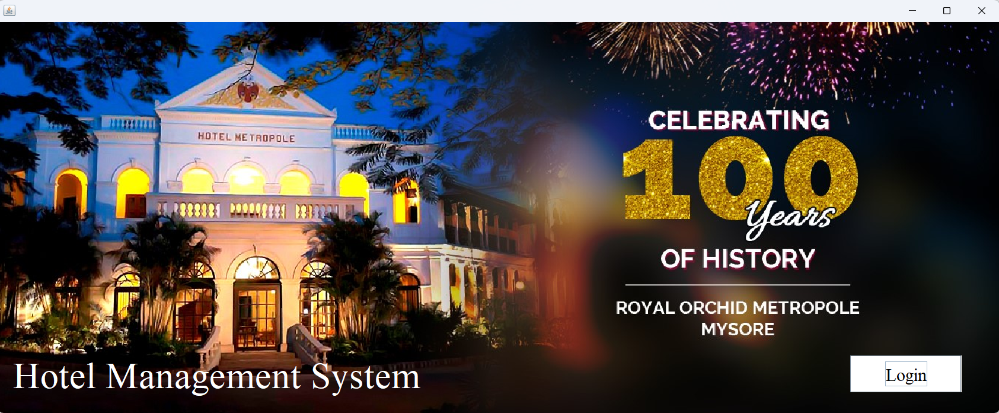
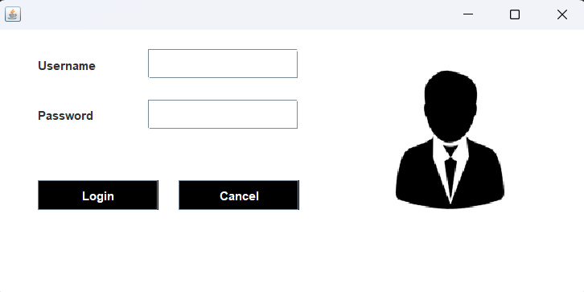
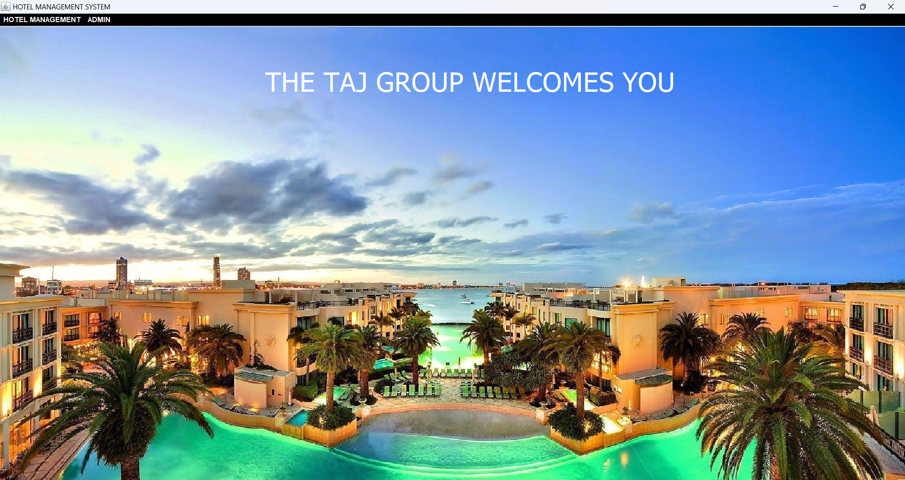
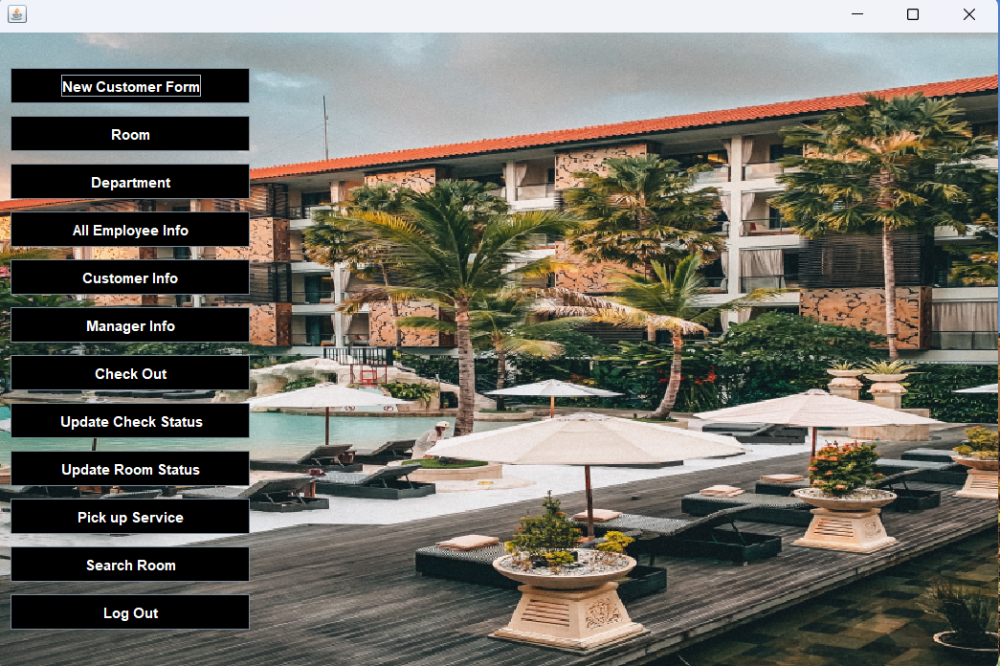
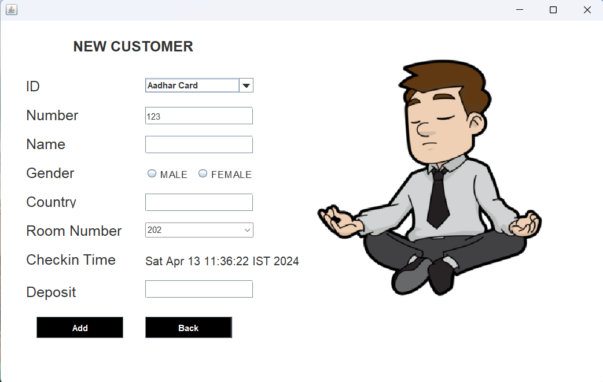
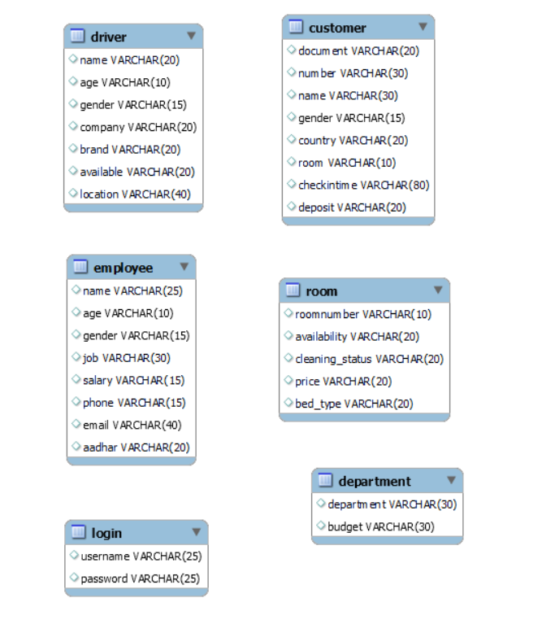

# Hotel Management System

[](LICENSE.md)

A Java Swing-based hotel management system with MySQL integration.

## Table of Contents
- [Introduction](#introduction)
- [Features](#features)
- [Getting Started](#getting-started)
  - [Prerequisites](#prerequisites)
  - [Installation](#installation)
- [Usage](#usage)
- [Screenshots](#screenshots)
- [Configuration](#configuration)
- [Database Schema](#database-schema)
- [Reports](#reports)
- [Contributing](#contributing)
- [License](#license)

## Introduction

The Hotel Management System is a Java-based application designed to simplify and automate various hotel management tasks. It offers an intuitive user interface created with Java Swing and leverages a MySQL database for data storage. This system can be used by hotel staff to manage bookings, customer information, room status, and more efficiently.

## Features

- User-friendly GUI for easy interaction.
- Management of customer data, including check-in and check-out.
- Booking management for different room types.
- Room status tracking and availability.
- Billing and invoicing system.
- Reports and statistics generation.

## Getting Started

### Prerequisites

Before you can use or contribute to this project, you need to have the following software and tools installed on your system:

- Java Development Kit (JDK) - Version 8 or higher
- MySQL Database Server
- Git (optional, for cloning the repository)
- VS Code

### Installation

1. Clone the repository to your local machine using Git or download it as a ZIP file.

```bash
git clone https://github.com/yourusername/hotel-management-system.git
```

2. **Open the project in your preferred Java IDE** (e.g., IntelliJ, Eclipse).

3. **Set up the MySQL database** by importing the provided SQL dump file (instructions may vary depending on your MySQL client).

4. **Configure the database connection settings** in the project code to match your MySQL server.

5. **Build and run the application**.

## Configuration
- Run the source command in mysql terminal
> source queries.sql

- Double Click on the Jar File

## Usage

- **Launch the application**.
- Use the GUI to **navigate and perform various hotel management tasks**.
- Follow the on-screen instructions to **manage customers, bookings, rooms, and generate reports**.

## Screenshots







## Database Schema


## Contributing
We welcome contributions to this project. To contribute, please follow the steps outlined in our [Contributing Guidelines](CONTRIBUTING.md).

## Contributing

We welcome contributions to this project. To contribute, follow these steps:

1. **Fork the repository**.
2. **Create a new branch** for your feature or bug fix.
3. Make your changes and **commit them**.
4. **Push your changes to your fork**.
5. **Create a pull request to the original repository**.

Please read our **[Contribution Guidelines](CONTRIBUTING.md)** for more details.

## License

This project is licensed under the **MIT License** - see the **[LICENSE](LICENSE)** file for details.

